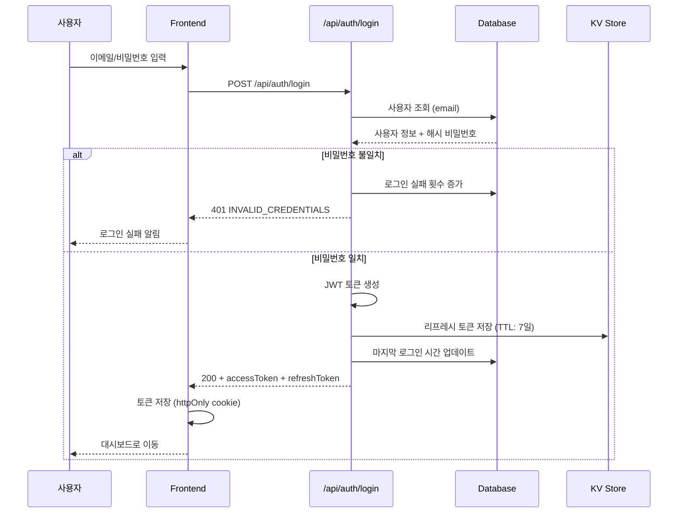
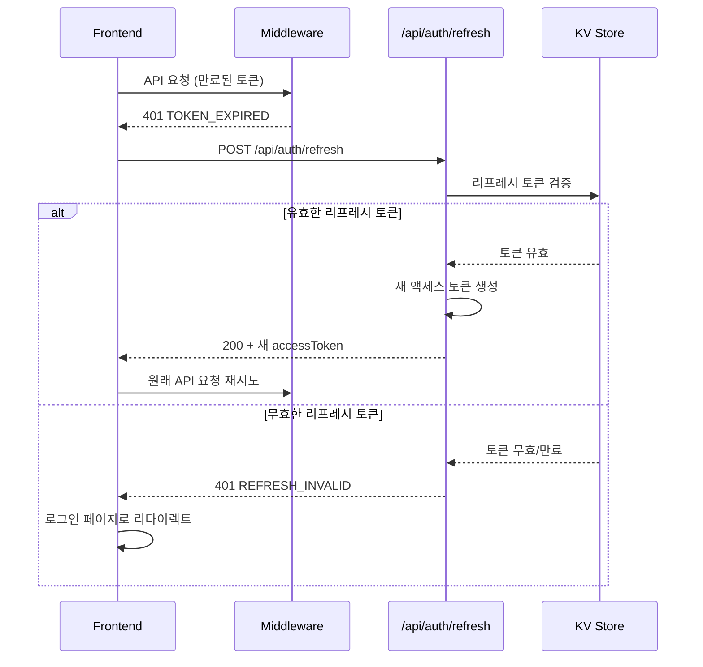
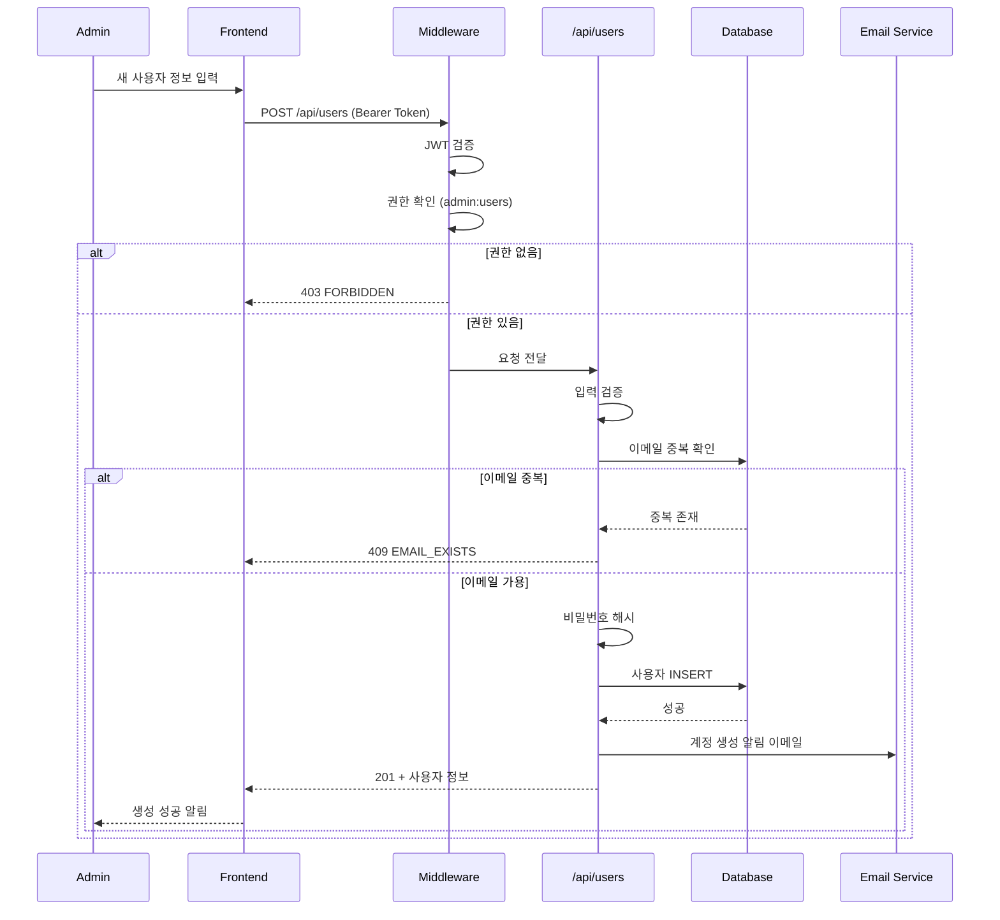

# 사용자 관리 API 설계 문서

> 버전: 1.0.0  
> 작성일: 2025-12-29  
> 설계자: Claude Architect

---

## 1. 개요

### 1.1 목적
PREMOAPI 대시보드의 사용자 인증 및 권한 관리를 위한 RESTful API 설계

### 1.2 범위
- 사용자 CRUD (생성/조회/수정/삭제)
- 인증 (로그인/로그아웃/토큰 관리)
- 권한 (역할 기반 접근 제어)
- 감사 로그 (사용자 활동 추적)

### 1.3 기술 스택
| 항목 | 기술 |
|------|------|
| 프레임워크 | Next.js 15 App Router |
| 런타임 | Edge Runtime (Cloudflare Workers) |
| 인증 | JWT (JSON Web Token) |
| 암호화 | bcrypt (비밀번호), AES-256 (토큰) |
| 저장소 | Cloudflare D1 (SQLite) / KV |

---

## 2. API 엔드포인트 명세

### 2.1 인증 (Authentication)

#### POST /api/auth/login
사용자 로그인 및 JWT 토큰 발급

**Request:**
```json
{
  "email": "user@example.com",
  "password": "securePassword123"
}
```

**Response (200):**
```json
{
  "accessToken": "eyJhbGciOiJIUzI1NiIs...",
  "refreshToken": "eyJhbGciOiJIUzI1NiIs...",
  "expiresIn": 3600,
  "user": {
    "id": "usr_12345",
    "email": "user@example.com",
    "name": "홍길동",
    "role": "operator"
  }
}
```

**Error Codes:**
| 코드 | 상태 | 설명 |
|------|------|------|
| INVALID_CREDENTIALS | 401 | 이메일 또는 비밀번호 불일치 |
| ACCOUNT_LOCKED | 403 | 5회 이상 로그인 실패로 계정 잠금 |
| ACCOUNT_DISABLED | 403 | 관리자가 비활성화한 계정 |

---

#### POST /api/auth/logout
로그아웃 및 토큰 무효화

**Headers:**
```
Authorization: Bearer <accessToken>
```

**Response (200):**
```json
{
  "success": true,
  "message": "로그아웃 되었습니다."
}
```

---

#### POST /api/auth/refresh
만료된 액세스 토큰 갱신

**Request:**
```json
{
  "refreshToken": "eyJhbGciOiJIUzI1NiIs..."
}
```

**Response (200):**
```json
{
  "accessToken": "eyJhbGciOiJIUzI1NiIs...",
  "expiresIn": 3600
}
```

---

### 2.2 사용자 관리 (Users)

#### GET /api/users
사용자 목록 조회 (관리자 전용)

**Headers:**
```
Authorization: Bearer <accessToken>
```

**Query Parameters:**
| 파라미터 | 타입 | 필수 | 설명 |
|----------|------|------|------|
| page | number | N | 페이지 번호 (기본: 1) |
| limit | number | N | 페이지 크기 (기본: 20, 최대: 100) |
| search | string | N | 이름/이메일 검색 |
| role | string | N | 역할 필터 (admin/operator/viewer) |
| status | string | N | 상태 필터 (active/inactive/locked) |

**Response (200):**
```json
{
  "data": [
    {
      "id": "usr_12345",
      "email": "user@example.com",
      "name": "홍길동",
      "role": "operator",
      "status": "active",
      "company": "HMC",
      "department": "구매팀",
      "createdAt": "2025-01-15T09:00:00Z",
      "lastLoginAt": "2025-12-29T08:30:00Z"
    }
  ],
  "pagination": {
    "page": 1,
    "limit": 20,
    "total": 45,
    "totalPages": 3
  }
}
```

---

#### GET /api/users/:id
특정 사용자 상세 조회

**Response (200):**
```json
{
  "id": "usr_12345",
  "email": "user@example.com",
  "name": "홍길동",
  "role": "operator",
  "status": "active",
  "company": "HMC",
  "department": "구매팀",
  "permissions": ["read:api", "write:api", "export:data"],
  "createdAt": "2025-01-15T09:00:00Z",
  "updatedAt": "2025-12-20T14:30:00Z",
  "lastLoginAt": "2025-12-29T08:30:00Z"
}
```

---

#### POST /api/users
새 사용자 생성 (관리자 전용)

**Request:**
```json
{
  "email": "newuser@example.com",
  "password": "tempPassword123!",
  "name": "김철수",
  "role": "operator",
  "company": "KMC",
  "department": "물류팀",
  "permissions": ["read:api", "export:data"]
}
```

**Response (201):**
```json
{
  "id": "usr_67890",
  "email": "newuser@example.com",
  "name": "김철수",
  "role": "operator",
  "status": "active",
  "requirePasswordChange": true,
  "createdAt": "2025-12-29T10:00:00Z"
}
```

**Validation Rules:**
- email: 유효한 이메일 형식, 고유값
- password: 최소 8자, 대/소문자/숫자/특수문자 포함
- name: 2-50자
- role: admin | operator | viewer
- company: HMC | KMC

---

#### PATCH /api/users/:id
사용자 정보 수정

**Request:**
```json
{
  "name": "김철수",
  "department": "IT팀",
  "role": "admin",
  "permissions": ["read:api", "write:api", "admin:users"]
}
```

**Response (200):**
```json
{
  "id": "usr_67890",
  "email": "newuser@example.com",
  "name": "김철수",
  "role": "admin",
  "updatedAt": "2025-12-29T11:00:00Z"
}
```

---

#### DELETE /api/users/:id
사용자 삭제 (소프트 삭제)

**Response (200):**
```json
{
  "success": true,
  "message": "사용자가 비활성화되었습니다.",
  "deletedAt": "2025-12-29T12:00:00Z"
}
```

---

### 2.3 역할 및 권한 (Roles & Permissions)

#### GET /api/roles
역할 목록 조회

**Response (200):**
```json
{
  "roles": [
    {
      "id": "admin",
      "name": "관리자",
      "description": "전체 시스템 관리 권한",
      "permissions": ["*"]
    },
    {
      "id": "operator",
      "name": "운영자",
      "description": "API 호출 및 데이터 조회/수정",
      "permissions": ["read:api", "write:api", "export:data"]
    },
    {
      "id": "viewer",
      "name": "조회자",
      "description": "데이터 조회만 가능",
      "permissions": ["read:api"]
    }
  ]
}
```

---

## 3. 시퀀스 다이어그램

### 3.1 로그인 플로우



### 3.2 토큰 갱신 플로우



### 3.3 사용자 생성 플로우



---

## 4. 데이터 모델

### 4.1 users 테이블

```sql
CREATE TABLE users (
    id TEXT PRIMARY KEY,           -- 'usr_' + nanoid(12)
    email TEXT UNIQUE NOT NULL,
    password_hash TEXT NOT NULL,
    name TEXT NOT NULL,
    role TEXT NOT NULL DEFAULT 'viewer',
    status TEXT NOT NULL DEFAULT 'active',  -- active, inactive, locked
    company TEXT,                  -- HMC, KMC
    department TEXT,
    permissions TEXT,              -- JSON array
    login_attempts INTEGER DEFAULT 0,
    require_password_change BOOLEAN DEFAULT FALSE,
    created_at TEXT NOT NULL,
    updated_at TEXT NOT NULL,
    last_login_at TEXT,
    deleted_at TEXT                -- 소프트 삭제
);

CREATE INDEX idx_users_email ON users(email);
CREATE INDEX idx_users_role ON users(role);
CREATE INDEX idx_users_status ON users(status);
```

### 4.2 refresh_tokens (KV Store)

```
Key: refresh_token:{userId}:{tokenId}
Value: {
    "userId": "usr_12345",
    "tokenId": "tok_abcdef",
    "deviceInfo": "Chrome/120 Windows",
    "createdAt": "2025-12-29T10:00:00Z"
}
TTL: 604800 (7일)
```

### 4.3 audit_logs 테이블

```sql
CREATE TABLE audit_logs (
    id TEXT PRIMARY KEY,
    user_id TEXT NOT NULL,
    action TEXT NOT NULL,          -- login, logout, create_user, etc.
    resource TEXT,                 -- /api/users/usr_12345
    details TEXT,                  -- JSON
    ip_address TEXT,
    user_agent TEXT,
    created_at TEXT NOT NULL
);

CREATE INDEX idx_audit_user ON audit_logs(user_id);
CREATE INDEX idx_audit_action ON audit_logs(action);
CREATE INDEX idx_audit_created ON audit_logs(created_at);
```

---

## 5. 보안 설계

### 5.1 인증 보안

| 항목 | 설정 |
|------|------|
| 비밀번호 해싱 | bcrypt (cost factor: 12) |
| JWT 알고리즘 | HS256 (대칭키) |
| Access Token TTL | 1시간 |
| Refresh Token TTL | 7일 |
| 로그인 실패 잠금 | 5회 실패 시 30분 잠금 |

### 5.2 API 보안

```typescript
// middleware.ts 보안 체크 순서
1. Rate Limiting (100 req/min per IP)
2. JWT 유효성 검증
3. Token Blacklist 확인
4. 역할 기반 권한 검증
5. 요청 로깅 (감사 로그)
```

### 5.3 CORS 설정

```typescript
const ALLOWED_ORIGINS = [
  'https://premoapi.example.com',
  'https://premoapi-staging.example.com',
  process.env.NODE_ENV === 'development' && 'http://localhost:3000'
].filter(Boolean);
```

---

## 6. 에러 코드 표준

| 코드 | HTTP | 설명 |
|------|------|------|
| UNAUTHORIZED | 401 | 인증 필요 |
| INVALID_TOKEN | 401 | 토큰 형식 오류 |
| TOKEN_EXPIRED | 401 | 토큰 만료 |
| FORBIDDEN | 403 | 권한 부족 |
| NOT_FOUND | 404 | 리소스 없음 |
| VALIDATION_ERROR | 400 | 입력 검증 실패 |
| EMAIL_EXISTS | 409 | 이메일 중복 |
| RATE_LIMITED | 429 | 요청 제한 초과 |
| INTERNAL_ERROR | 500 | 서버 내부 오류 |

---

## 7. 구현 우선순위

### Phase 1: MVP (1주)
- [x] 설계 문서 작성
- [ ] /api/auth/login
- [ ] /api/auth/logout
- [ ] JWT 미들웨어
- [ ] 기본 사용자 모델

### Phase 2: 사용자 관리 (1주)
- [ ] /api/users CRUD
- [ ] 역할 기반 권한 검증
- [ ] 입력 검증 유틸리티

### Phase 3: 보안 강화 (1주)
- [ ] Rate Limiting
- [ ] 감사 로그
- [ ] 토큰 갱신 플로우
- [ ] 계정 잠금 로직

---

## 8. 파일 구조 (제안)

```
src/app/api/
├── auth/
│   ├── login/route.ts
│   ├── logout/route.ts
│   └── refresh/route.ts
├── users/
│   ├── route.ts              # GET (list), POST (create)
│   └── [id]/route.ts         # GET, PATCH, DELETE
├── roles/
│   └── route.ts              # GET
└── _lib/
    ├── auth.ts               # JWT 생성/검증
    ├── password.ts           # 해싱/검증
    ├── validate.ts           # 입력 검증
    └── middleware.ts         # 인증 미들웨어

src/app/middleware.ts         # 전역 미들웨어
```

---

## 9. 참고

### 9.1 관련 문서
- [Next.js Route Handlers](https://nextjs.org/docs/app/building-your-application/routing/route-handlers)
- [Edge Runtime](https://nextjs.org/docs/app/building-your-application/rendering/edge-and-nodejs-runtimes)
- [JWT Best Practices](https://datatracker.ietf.org/doc/html/rfc8725)

### 9.2 기존 코드 참조
- OAuth 패턴: `src/app/api/oauth/route.ts`
- API 호출 패턴: `src/app/api/call/route.ts`
